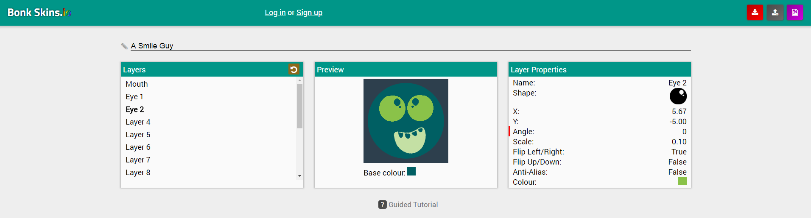

*This project has been completed.* Voting is not fully implemented, however.

*bonk.io* is an online web-based multiplayer game whereby four players verse each other in a competition to hit each other off the screen.
Each player can design and customise a “skin” (a design for their avatar) for themselves.

The project purpose is to have a website that is a user contributed database of bonk.io skins that users can **create**, **share**, and **vote** on to have a community of creators in a functioning and dynamic website.
Users will use an in-site **skin editor** with a **drag and drop interface** that is then saved to a central database as a post, which can be voted up by other users and climb rankings over time.

Made with **HTML**, **CSS**, **Javascript**, **PHP** and **SQL** to be hosted on an Apache server (XAMPP was used during development).

The project was started with the intention to learn
* Database concepts
* Server-side user input validation and cleansing
* User login sessions
* Advanced interactive applications (the skin editor)
* Storing of user credentials
* File saving and loading
* CSS Flexbox

# The Skin Editor

The skin editor code is in `./src/scripts/editor.js`. It is implemented with multiple JS canvasses stacked on top of eachother that are merged into a single image when the skin is submitted.



It features a fully interactive drag and drop interface whereby images can be placed on layers and their rotation, scale, position, flip, colour tint and anti-aliasing can be controlled.

Layers can be renamed, copied, ordered and deleted.

Submitting a skin to the database will save the thumbnail as its own image, and its layer data will be saved as a JSON representation of the skin.  
Skin data can be saved as a `.bskin` file which can be sent to friends and uploaded elsewhere, and then imported back into the site.

The skin editor also features an interactive tutorial which walks the user through how to edit layers, shapes and submitting your skin publicly.

# Installation and Setup

Server-side processing, rendering and database interactions are handled by PHP running off of an Apache server (XAMPP was used during development).

To be able to connect to a database a configuration file must be created in `./src/assets/imports/config.php` which will define your connections and authentication to an SQL database.

Template `config.php`:

```
<?php
  $server_ip = "DB_URL";
  $server_user = "DB_USER";
  $server_password = "DB_PASS";
  $server_db = "DB_NAME";
```

Once this file is created with the correct credentials execute `bonk-skins.sql` on your database. This will create the tables `skins` and `users`.

When this has been done simply start up the Apache server and database server and navigate to `index.php`.
